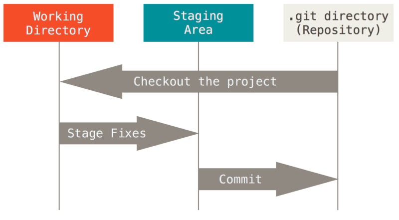

> 오늘 배웠던 내용에대해 md 파일로 작성해보기


# 0.git & github를 배우는 이유

> git을 이용한 버전관리
>
> github를 이용한 포트폴리오 , 백업, 복구, 협업


# 1.CLI

> GUI 보다 빠르다


## 경로

+ 절대경로: 루트 디렉토리부터 목적지점까지 거치는 모든 경로를 전부 작성한것.
  + /c/Users/suyeo/TIL
+ 상대경로: 현재 작업하고있는 디렉토리를 기준으로 계산된 상대적위치
  + 현재작업 디렉토리: /c/Users/suyeo, 상대경로: TIL
  + 상대경로로 이동
    + 상위폴더로 이동: cd ..
    + 현재 폴더: cd .
    + 하위폴더로 이동: cd (폴더이름)


## 터미널 명령어

+ **touch**
  + 파일을 생성
+ **mkdir**
  + 새로운 디렉토리(폴더)를 생성
+ **ls**
  + 작업중인 디렉토리의 폴더/파일 목록을 보여줌.
    + -a : 숨김 파일까지 표현됨.
+ **mv**
  + 폴더/파일을 다른 폴더내로 이동하거나 이름을 변경할때 사용
  + mv (이동하려는 폴더/파일명) (바꾸려하는 목적지)/[^2]
  + 이때, **바꾸려하는 목적지의 폴더**가 없을경우 **이동하려는 폴더/파일명**이 바꾸려하는 목적지의 이름으로 변경된다. (파일명을 변경하고싶을때 사용하는방법)
+ **cd**
  + 현재 작업중인 디렉토리(폴더)를 변경
    + cd .. :상위폴더로 이동
    + cd - : 뒤로 가기

+ **rm**
  + 폴더/파일을 지움.
  + 휴지통으로 이동하지않고 **완전삭제**되므로 주의.
    + -r :  폴더를 지울때 사용하는 옵션, 폴더 하단에 있는 폴더를 재귀적으로 삭제
    + -rf : 강제로 삭제하는 옵션 (비추)

  + <u>**되도록이면 GUI 환경에서 삭제하자**</u>

+ **pwd**
  + 현재의 위치 (디렉토리의 위치)를 확인할때 사용
  + 절대경로 사용시 pwd 찍고서 위치복사해서 사용.


## 유용한 단축키

- tab : 자동완성
- ctrl+l : 터미널 화면 청소 (과거내역 조회가능)
- clear : 터미널 화면 청소 (과거내역 조회불가능)
- 화살표 ↑ ↓ : 이전라인 가져오기


# 2.마크다운(Markdown)

> 마크다운이란 HTML같은 마크업을 더 쉽고 간단하게 쓰기위해 만들어졌다.


## 마크다운 문법 

✔ **띄어쓰기에 주의한다** 

+ **제목**

  + `#`을 사용한다

  

+ **목록**

  + 순서가 없는 목록
    + `-,*,+` 

  + 순서가 있는 목록
    + `1. 2. 3.`

  + 들여쓰기는 `tab`키를 이용[^내어쓰기]


+ **강조** : 글자를 강조하고 스타일을 넣어줄수있다.
  + 기울임 : `*글자*`,`_글자_`
    + 단축키는 `ctrl + i`[^1]
  + 굵게 : `**글자**` , ` __글자__`
    + `ctrl + b`[^1]
  + 취소선 넣기 : `~~글자~~`
  + 밑줄[^1] : `ctrl + u`


+ **코드**
  + 한줄코드 (인라인코드) : `백틱` 사용
  + 여러줄 코드 (블록코드) : ` ```python` 백틱 3번 입력후 코드의 종류 작성
    + git은 ````bash`로 작성하면됨.


+ **링크**
  + `[표시할글자](이동할주소) `형태로 작성
    + 링크 들어가기 : `ctrl + 링크 클릭`


+ **이미지**
  + 수동 :  ``
    + 대체 텍스트 : 이미지에 오류가 생길시 대체되어 표시되는 문구
  + 자동 :  이미지 파일을 끌어와서 놓아도 자동업로드됨[^1]


+ **인용**
  + `>` , 중첩 가능 (tab키)


+ **표**
  + `ctrl + T`[^1] 
  + 행을 늘릴때 : `ctrl + enter`


+ **수평선**
  + `- , * , _` X  3 번이상 연속으로


# 3.Git

> git은 버전관리 프로그램
>
> github는 git에서 수행한 버전을 받아 협업할수있게 도와주는 도구


## Git & github 사이클


`(아직한번도 staging area에 올린적 없을때)`

1. Working Directory(대기실)에서 작업 (`status`: `Untracked`[^s1] )
2. 작업물을 Git으로 관리할수있게끔 `git init`실행 (`status`: `Tracked`[^s2])
3. wd(대기실)에 있는 작업물을 Staging Area(무대)로 올린다. `git add` 실행 (`status`: `Tracked`[^s2] , `staged`[^s5])
4. sa(무대)에 올라온것을 Commit(커밋)에 저장해준다. `git commit -m` 실행 (`status`: `Tracked`[^s2] , `Unmodified`[^s3])
5. 작업물을 수정했다 (`status`: `Tracked`[^s2] , `Modified`[^s4])
6. 수정한 작업물을 다시 sa(무대)에 올려준다. `git add`실행 (`status`: `Tracked`[^s2] , `staged`[^s5])
7. sa(무대)에 올라온 수정된 작업물을 다시 cm(커밋)에 저장. `git commit -m` 실행 (`status`: `Tracked`[^s2] , `Unmodified`[^s3])
8. 작업물이 마음에 안든다. 파일 삭제 (`status`: `Untracked`[^s1] )
9. 우여곡절 끝에 드디어 `작업물_진짜진짜최종.md` 완성했다. 로컬저장소의 커밋에 저장까지 해준상태. 이젠 `github`에서 원격저장소를 만들어준다. `github`페이지에서 `Create a new repository`로 원격저장소의 이름, 설명 설정
10. 이젠 로컬저장소의 커밋에 저장된 내용을 `github`의 원격저장소와 연결해준다. 원격저장소 등록 `git remote add`실행.
11. 커밋 업로드 `git push` 실행


<u>강의자료 참고</u>




## 로컬저장소

+ **Working Directory (대기실)**
  + = Working Tree, 사용자의 일반적인 작업이 일어나는곳이다


+ **Staging Area (무대)**
  + = Index, 커밋을 위한 파일 및 폴더가 추가되는곳 (기록을 위한 대기장소)


+ **Repository**
  + 무대에 있던 파일 및 폴더의 변경사항(커밋)을 저장하는곳! 
  + 변경사항들만 저장한다
  + **Commit은 기록한다는 의미**


## Git 명령어

+ **git init**
  + 현재 작업중인 디렉토리를 git으로 관리하겠다
  + `.git/` 이라는 숨김폴더가 생성된다면 잘 된것
  + 터미널에는 `master`라고 표기됨

<u>**주의사항: 이미 git 저장소인 폴더내에 또 다른 git저장소를 만들면 안된다.(중첩금지)**</u>


+ **git status**
  + 파일의 git 진행 상태 확인
    + `Untracked`[^s1] 
    + `Tracked`[^s2] 
      + `Unmodified`[^s3]
      + `Modified`[^s4]
      + `staged`[^s5]
  + 수시로 확인해주기


+ **git add**
  + wd(대기실)에 있는 파일을 sa(무대)로 올리는 명령어
    + `Untracked`[^s1] -> `staged`[^s5]
    + `Modified`[^s4]->  `staged`[^s5]
  + git이 해당파일을 추적(관리)할수있도록 만든다
  + `git add (특정파일/폴더명)`[^2]
    + `git add . `으로 써도됨. (대신 디렉토리에 있는 하위 디렉토리의 내용까지 전부 올라감)


+ **git commit(기록)**
  + sa(무대)에 올라온 파일의 변경사항을 하나의 버전(커밋)으로 저장하는 명령어
  + `git commit -m`
    + `git commit`으로 쓰면 `vscode`상에 커밋메세지를 남길수있는 에디터가 뜨고 메세지 입력후 `ctrl + s` 저장해준후 창 닫으면 메세지 반영하여 commit 된다


+ **git log**
  + 변경사항의 기록 (커밋의 내역)을 조회할수있는 명령어
  + `git log --oneline`
    + `git log`만 쓰면 표시할 내용이 너무 많아져 커밋내역이 다 안뜨는 오류가 생기면서 `$`옆이 아닌 `:`옆에  커서가 위치해있을수있는데 이땐 `q`눌러서 종료해주면된다


# 4.github

> 원격저장소


## 원격저장소를 만들고 로컬과 연결하기까지 (remote)

1. `github`에서 `Create a new repository`로 원격저장소를 만들어주고 원격저장소의 이름, 설명등등 설정해준다

2. 원격저장소가 생성된후 저장소의 주소를 복사한다

3. 로컬저장소와 연결하기위해 `git remote` 명령어를 사용해준다 (`git remote add <원격저장소의 이름> <원격저장소의 주소>`)
   + 원격저장소 조회 : `git remote -v`
   + 원격저장소 연결 삭제 : `git remote rm <원격저장소의 이름>` , 연결만 끊는것이지 원격저장소를 삭제하는 기능이 아니다.

4. `git remote add <원격저장소의 이름> <원격저장소의 주소>`에서 원격저장소의 이름은 `origin`으로 쓰는게 관례다.

   + `git remote add origin 주소`

   


## 원격저장소에 업로드 (push)

1. 로컬저장소의 커밋을 원격저장소에 업로드하기위해 `git push` 명령어를 사용해준다.

   + `git push <원격저장소의 이름> <원격저장소의 브랜치 이름>`
  + `git push origin master`로 쓰는게 관례다.
   + `-u`옵션 사용시 두번째 커밋부터는 저장소이름, 브랜치이름 생략가능
     + `git push -u <원격저장소의 이름> <원격저장소의 브랜치 이름>`

2. 자격증명 (`github 로그인`)

3. 원격저장소에서 정상업로드 확인


*****

[^1]: 타이포라에서만 가능
[^2]: 폴더명 뒤에 / 붙여준다
[^s1]: Git이 관리하지않는 파일 (한번도 Staging Area에 올라간적 없는 파일)
[^s2]: Git이 관리하는 파일
[^s3]: 최신상태 , 최근에 한 작업까지 Commit으로 저장되어있는 상태
[^s4]: 수정되었지만 아직 Staging Area에는 반영하지않은 상태, git add로 staging에 올려주면된다.
[^s5]: Staging Area에 올라간 상태
[^내어쓰기]: shift + tab (마크다운 단축키) ↩

