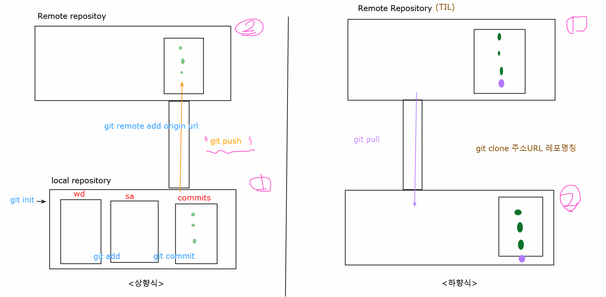
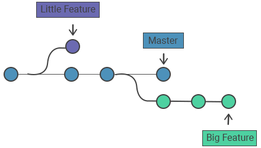
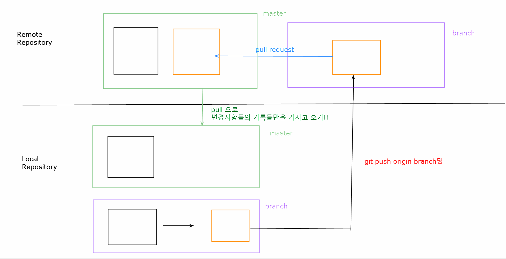
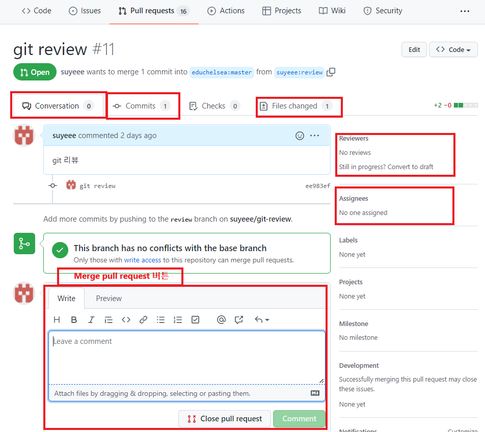
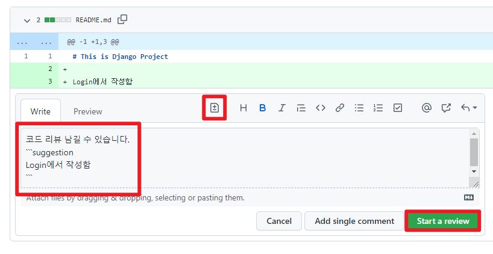
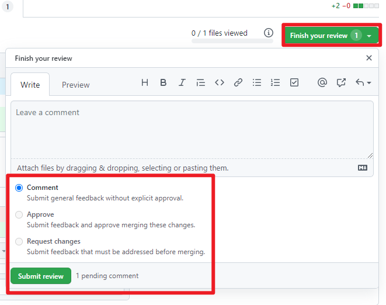
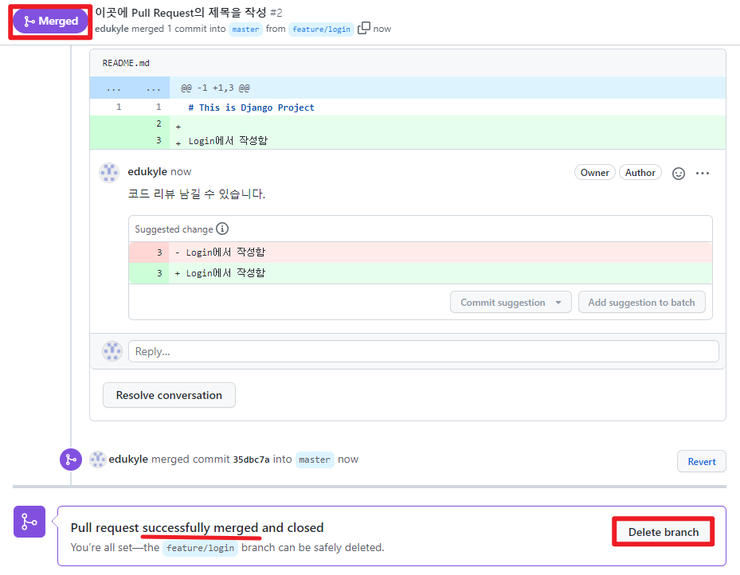

> 배운내용 복습 2일차
>
> github는 **백업, 복구, 협업**을 하기위해 배우는 도구!!!

# 5.Clone,Pull

## 그림으로 이해해보기

+ 하향식을 하게되면 이미 길이 뚫어져있으므로 `git init`,`git remote` 안해도됨.
+ `git pull`은 `git push`와 형태가 같다. (`git push origin master` , `git pull origin master`)
+ `git pull`은 원격저장소에서 끌어오는것임.

##  clone 명령어

+ **git clone**
  + 원격저장소의 커밋내역을 모두 가져와서, 로컬저장소를 생성하는 명령어
  + 원격저장소가 통째로 복제된다. (처음에 한번만 실행, `git init`과 비슷)
  + `git clone <원격저장소의 주소>`
    + `git clone <주소> <이름>` 은 원격저장소에서 썻던 이름과는 다른 이름으로 변경하여 로컬저장소에 저장할수있다. (이름만 변경, 파일내용은 동일)
  + `clone` 한번에 `git init` & `git remote add`  포함됨. (clone하는 순간 이미 원격저장소와 로컬저장소 사이에 길이 생김.)
  + **<u>주의사항:</u> `git init` 되어있는 디렉토리에 `git clone`하면 안됨!!!** 

+ **git pull**
  + 원격저장소의 변경사항을 가져와서, 로컬저장소를 업데이트하는 명령어 (업데이트할 내용이 없다면 변화없음)
  + `git pull <원격저장소 이름> <원격저장소의 브랜치 이름>`  ( `git pull origin master`로 쓰는게 관례임.)
  + `git push`와는 방향만 다를뿐 `동기화`한다는 기능은 동일함.
    + `git push`: 로컬저장소-> 원격저장소
    + `git pull`: 원격저장소-> 로컬저장소
  + `git clone`을 했다면 무조건 `git pull`부터 찍어보고 시작하기 (동기화부터 해놓고 시작)

> 충돌주의!!!!!! (conflict)
>
> github 페이지에서 파일내용을 수정하면 협업시 충돌(에러)이 생길수있으니 (같은파일의 같은 라인을 동시에 수정한 경우)
>
> **<u>해결법</u>**: `git pull` 해준후 `accept`  선택해주고나서 다시 `add-> commit-> push`  해주면된다

# 6.Branch

> 나뭇가지처럼 작업영역을 여러개로 나누어서 독립적으로 작업할수있게함

## 브랜치 그림

## 브랜치의 필요성

(<u>강의자료 복붙</u>)

- 예시 : `카카오 개발자` -> 카카오톡의 채널 탭을 신규 개발하라는 과업
  - 1번 ) master branch에서 그대로 작업한다.
    - master란? 이미 상용화되어 서비스 되고 있는 곳
      - 이미 세상에 나와있는 서비스 => 카카오톡
    - 작업하다가 에러가 난 경우? -> 작업하다가 서비스 장애가 생긴 경우
      - 카카오 그룹 대국민 사과
      - 비즈니스 **-** !!!
  - 2번) 신규 개발을 위한 branch를 생성하여 작업한다.
    - 신규로 branch 생성 -> 작업 -> 버그 처리 -> QA
    - 작업 완료된 기능을 다시 ! master에 합니다!!

<u>**예시의 임무를 진행하기위해서는 신규로 브랜치를 생성한후 작업하는 2번 방법으로 하면된다!!**</u>

## branch 명령어

+ **git branch**
  + 브랜치의 조회, 생성,삭제
    + 브랜치 조회(목록확인): `git branch`
      + 원격저장소의 브랜치 목록도 포함 : `git branch -r`
    + 브랜치 생성 : `git branch <새로운 브랜치 이름>`
      + 특정 커밋 기준으로 브랜치 생성 : `git branch <new 브랜치 이름> <커밋 ID>`
    + 브랜치 삭제 : `git branch -d <브랜치 이름>` (병합된 브랜치만 삭제 가능)
      + 강제 삭제(주의!!) : `git branch -D <브랜치 이름>` (병합되지않은 브랜치도 삭제가능)

+ **git switch**
  + 현재 브랜치에서 다른 브랜치로 HEAD 포인터를 이동시키는 명령어
    + 다른 브랜치로 이동: `git switch <이동하고자 하는 브랜치명>`
    + 생성과 동시에 이동: `git switch -c <new 브랜치명>`
    + 커밋 아이디를 기준으로 브랜치 생성과 동시에 이동: `git switch -c <new 브랜치명> <커밋ID>`
  + HEAD 포인터가 잘 이동했는지 확인하려면 디렉토리 경로 옆 괄호표시보고 확인하면됨.
  + <u>지금 작업하고있는 브랜치를 `버전관리(add->commit)`해주지 않고 `git switch` 로 브랜치를 이동하면 독립적인 작업이 불가능해진다. `git switch`로 이동한 브랜치에서도 전에 작업한 내용이 그대로 옮겨져오기때문....</u>

# 7.Branch Merge

> 각 브랜치에서 작업이 끝난후 master 브랜치에 반영하기위해 하는 병합

## merge(병합) 명령어

+ **git merge**
  + 분기된 브랜치들을 하나로 합치는 명령어
  + `git merge <합칠 브랜치 이름>`
  + `git merge` 하기전에 메인 브랜치로 `git switch` 해주어야함.

## merge의 종류

+ Fast-Forward
+ 3-Way Merge
+ Merge Conflict

일단 해보고 나중에 공부한뒤 내용 더 채워넣을것!

 # 8.Git workflow

## 원격저장소 소유권이 있는 경우

+ **개념**

  + 원격저장소가 자신의 소유이거나 `collaborator` 로 등록되어있는경우 사용가능함.

  + master에 직접개발하는거 아니고 기능별로 브랜치를 따로 만들어서 개발

  + `pull request` 를 같이 사용하여 팀원 간 변경내용에 대한 소통을 진행한다.

+ **작업흐름**

  1. 소유권이 있는 원격저장소를 로컬저장소로 `git clone` 한다.

  2. 자신이 작업해야할 기능에 대한 `branch` 를 새로 생성, 새롭게 만든 브랜치 안에서 기능들 구현 (`git switch -c  <new branch>`)

  3. 기능 구현을 완료했으면 원격저장소에 해당 브랜치를 `push` 해주어야한다. (add-> commit-> `git push origin <new branch>`)

  4. 원격저장소에 `master`와  `new branch`가 반영되었다. (`github에서`)

  5. `pull request` 를 통해 브랜치를 `master`에 반영해달라는 요청을 보내야한다 (`github에서`)

  6. 병합이 완료된 브랜치는 불필요하므로 원격 저장소에서 내가 만든 브랜치 삭제! (`github에서`)

  7. 삭제한후 로컬저장소에서 `master` 브랜치로 이동 (`git switch master`)

  8. 병합으로 인해 변경된 원격저장소의 `master` 내용을 로컬에 받아온다. (`git pull origin master`)

  9. 병합이 완료된 `master` 의 내용을 받았으니 내가 만들었던 브랜치는 불필요하므로 로컬 브랜치삭제! (`git branch -d <내가 만든 기능 브랜치 이름>`)

  10. 새로운 기능추가시 새로운 브랜치 생성하며 2번부터 반복하면됨. (`git switch -c <new_new branch>`)

## 원격저장소 소유권이 없는경우

+ **개념**
  + 오픈소스 프로젝트같이 내 소유가 아닌 원격저장소의 경우 사용한다.
  + 원본 원격저장소를 그대로 내 원격저장소에 복제한다. (`fork` 라고 부른다, 푹 찍어온다)
  + 기능 완성후 ` push`는 복제한 내 원격저장소에 진행한다
  + 이후 `pull request` 를 통해 원본 원격저장소에 반영될수있도록 요청한다

+ **작업흐름**
  1. 소유권이 없는 원격저장소를 `fork` 를 통해 내 원격저장소로 복제한다  (`github에서`)
  2. `fork` 후, 복제된 내 원격저장소를 로컬저장소에 `clone` 받는다.
  3. 로컬저장소와 원본 원격저장소를 동기화하기위해 `remote` 로 연결해준다 (`git remote add upstream <원본원격저장소의 주소>` , <u>원본원격 저장소의 이름은 `upstream`으로 붙여주는게 관례.</u>)
  4. 내가 작업할 기능에 대한 `new branch` 를 생성하고 , 그 안에서 기능구현 (`git switch -c <new branch>`)
  5. 기능구현이 완료되면 복제한 내 원격저장소(origin)에 `new branch` 를 `push` 해준다. (add-> commit-> `git push origin <new branch>`)
  6. 복제한 내 원격저장소 (이름: origin)에는 `master`와 `new branch` 가 반영되었다. (`github에서`)
  7. `pull repuest` 를 통해 <u>`복제원격저장소(내꺼,이름:origin)의 new branch`</u>를 <u>`원본원격저장소(원본,이름:upstream)의 master`</u> 에 반영해달라는 요청을 보낸다. 원본원격저장소의 관리자가 코드를 리뷰해보고 반영여부를 결정한다. (`github에서`)
  8. 원본 원격저장소의 관리자가 반영 허락해주었으면  <u>`원본원격저장소(원본,이름:upstream)의 master`</u> 에 내꺼 `new branch`가 병합된다. 그럼 `복제원격저장소(내꺼,이름:origin)` 의 `new branch` 는 삭제한다. (`github에서`)
  9. 삭제한후 로컬저장소에서 `master` 브랜치로 이동 (`git switch master`)
  10. 병합으로 인해 변경된  <u>`원본원격저장소(원본,이름:upstream)의 master`</u>  내용을 로컬에 받아온다. (`git pull upstream master`)
  11. 기존의 로컬 브랜치는 삭제한다. (`git branch -d <new branch>`)
  12. 새로운 기능추가시 새로운 브랜치 생성하며 4번부터 반복하면됨. (`git switch -c <new_new branch>`)

## Pull Repuest 용어정리

+ `base`는 병합될 대상
  + 원본원격저장소의 `master`를 `base`로 두면된다.
+ `compare`는 병합할 대상
  + 내꺼 원격저장소의 `new branch`를 `compare`로 두면된다.

+ `Reviewers` : 현재 PR (pull repuest)에 대해 코드 리뷰를 진행해줄 담당자

+ `Assignees` : 현재 PR (pull request)에 대한 작업을 맡고있는 담당자

+ PR이 생성되면 

  

  

  

  + `Conversation` : 아래 `write` 부분에 comment를 별도로 작성할수있다. 그리고 내가 pull request (내가 원본 원격저장소인 경우)를 받은경우 위 화면에서 `Merge pull request` 버튼이 나오는데 그걸 누르면 병합이 시작된다.
    + conflict (충돌) 상황에서는 충돌 해결하라고 나온다
  + `Commits` : PR 을 통해 반영될 커밋들을 볼수있다.
  + `Files changed` : 파일의 변화 내역들을 볼수있다.

  

+ `Files changed` 영역에서 코드리뷰를 남길땐 원하는 라인에서 `+` 를 눌러 해당라인에 리뷰를 남길수도 있다. 빨간 사각형으로 표시된 작은 아이콘을 클릭하면 `suggestion 기능` (코드를 이렇게 바꾸라고 추천하는 기능)을 넣을수도 있다.

+ 코드 리뷰를 끝내려면 `Finish your review` 버튼을 누르면 된다. 그리고 옵션을 선택하고 `Submit review`를 클릭한다.

  

  

  + `Comment`: 추가적인 comment를 작성할 경우 선택
  + `Approve`: merge를 승인하는 경우 선택
  + `Request change` : 수정해야 하는 사항이 있을 경우 선택

+ 병합을 하게 되면 아래와 같이 보라색으로 병합이 완료되었다고 나오면는데 그러면 완료된것. `Delete branch` 버튼을 통해 병합된 `new branch`(내가 만든 브랜치 또는 내가 병합허용해주는 입장이면 상대방이 만든 브랜치)를 지울 수 있다. 

  + 단, 원격 저장소에서만 지워지니 로컬저장소에 있는 `new branch`는 직접 지워야됨.(`git branch -d <new branch>`)

  

# 기타 git 명령어

+ `git log --oneline --all`
+ `git commit --amend` : 커밋 메세지 수정 (비추함. 충돌우려)
+ `git reflog` : 해시값 확인가능 (커밋들 앞에 붙는 일련변호 같은거)
+ `git diff` : 현재 변경사항들의 정보확인
+ `git diff <커밋1 ID> <커밋2 ID>` : 해시값 사이의 차이 (커밋들간의 차이점)

******

